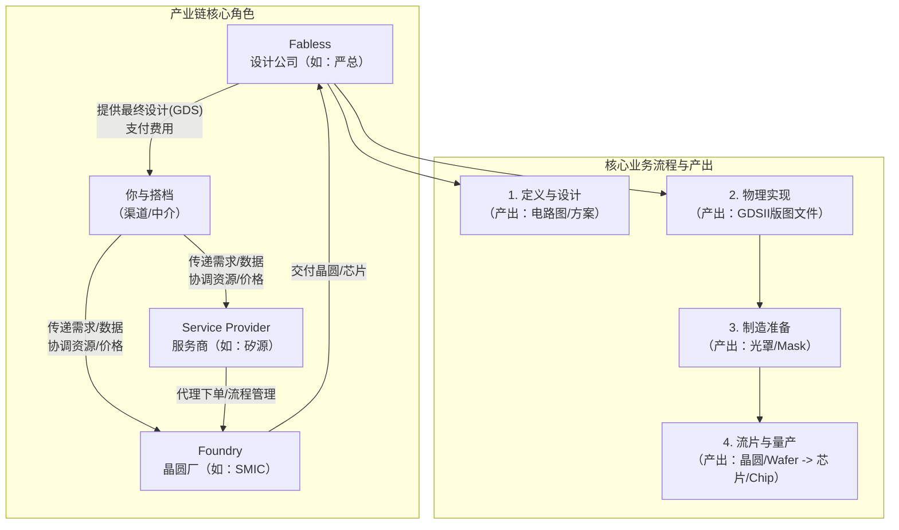

# 第一章：行业生态与角色定位

## 全景图：谁在芯片产业链上



这张图是整个知识体系的骨架，理解它就能理解你的生意在每个节点上的位置。

---

## 各角色详解

### Fabless（无晶圆厂设计公司）

**是什么：** 只负责芯片设计和销售，不拥有晶圆厂。代表：高通、联发科、博通、以及你对接的各类客户。

**核心诉求：** 用最低的成本、最快的周期，把设计变成可销售的芯片。

**力量关系：** 他们是技术的源头和需求的发起方，看起来是"甲方"，但实际上在晶圆厂面前没有太多话语权——中小 Fabless 很难直接跟 SMIC / TSMC 这种人谈价格和产能。

**行业惯例：**
- 大部分中小 Fabless 不会同时跟多家晶圆厂合作——换工艺平台的成本极高（设计工具、PDK、IP 全部重来），所以一旦上了某条线，基本绑定
- Fabless 内部最焦虑的阶段是 Tape-Out 到 JDV 之间——这时设计已经交付，但还没出结果，任何修改都意味金钱和时间的双重损失
- 很多小的 Fabless 老板就是技术负责人出身，对供应链细节不熟悉，需要你帮他"翻译"和"领路"

---

### Foundry（晶圆代工厂）

**是什么：** 拥有晶圆厂，按客户提供的 GDS 制造芯片。代表：台积电（TSMC）、中芯国际（SMIC）、华虹。

**核心诉求：** 填满产能、提高良率、维持高利润。

**力量关系：** 这个链条上**话语权最大**的角色。产能紧张时，Foundry 决定谁能拿货、谁等。他们不跟小客户直接沟通，也不在乎单个小客户的订单量。

**行业惯例（关键）：**
- **Foundry 不看关系看"流水"** —— 你在大厂的月度订单量（比如 1000 片/月）才是硬通货。这就是为什么你搭档在中兴/大客户处的资源能撬动 SMIC 的价格
- **建 Code 门槛极高** —— SMIC 要求月产能承诺通常在千片以上，而且新客户开户要 3-6 个月审核。这是中小 Fabless 最大的准入障碍
- **MPW 是 Foundry 的"清仓促销"** —— 把产线上空余的位置拼卖给多个客户，本质上是为了填满产能、多赚一份钱，不是慈善
- **Wafer Cost 可以谈，但起步价就是高** —— Foundry 给大客户的单价可以比小客户低 15-30%，这个差价就是你的利润空间来源
- **JDV 确认后 Foundry 变脸** —— 在 JDV 之前，还愿意配合修改；JDV 释放后，任何修改都要重新收光罩费，态度立刻变硬

---

### IDM（集成器件制造商）

**是什么：** 设计、制造、封测全包。代表：英特尔、三星、TI。

**核心关系：** IDM 通常不对外代工，或者只在产能过剩时才有限开放。跟你业务交集不大，但在行业格局里是重要角色——他们掌握着最先进的工艺节点（如 3nm/5nm）。

---

### 你与搭档（渠道/中介）

**你的生态位：** 你不是设计者，也不是生产者，而是**价值的连接器与放大镜**。

**你的核心资源：** 搭档在大客户/中兴处的渠道，让 SMIC 把你们当作"大客户体系的一部分"来看待，从而获得：
- 更低的价格（Wafer Cost 比市场价低 10-20%）
- 更高的优先级（产能紧张时你仍有配额）
- 更快的周期（插队能力）
- 建 Code 的绿色通道（新客户通过你们走，不用自己开）

**行业惯例中"中介"的真实价值：**

很多人觉得芯片代工是"你买东西我卖东西"的中介，实际上不是。你的价值体现在三个只有中介才能做的事情上：

1. **资源杠杆** — 你一个人的生意规模不足以跟 SMIC 谈价，但你搭档的规模可以。你是在借大客户的量来养小客户的价
2. **流程润滑** — Fabless 跟晶圆厂之间天然有沟通断层：晶圆厂用工艺语言（"你们的 NW layer 需要确认"），Fabless 用设计语言（"这个地方还能改吗？"）。你两边都懂一点，能在 DRC 反复、JDV 确认、Retooling 谈判这些关键节点上把效率提上去
3. **风险缓冲** — 流片出问题时（DRC 没过、错过班次、良率低），Fabless 直接面对晶圆厂几乎没有谈判余地。你作为渠道，可以用"长期合作伙伴"的身份去争取免费修改、插班、降价补片等软性处理

**这里有个行业现实：** 你的价值在产能紧张时最大，在产能过剩时最小。芯片行业有强烈的"牛鞭效应"——行情好的时候 Foundry 产能抢手，Fabless 愿意付溢价抢产能；行情差的时候 Foundry 反过来找客户，价格透明化，中介的空间被压缩。

---

### Service Provider（服务商/代理）

**是什么：** 提供 PDK 支持、MPW 拼单、流程管理、商务对接等专业服务。如矽源。

**与你的关系：** 他们是链条上的既有玩家。你不一定要替代他们——很多时候你是跟他们合作（通过他们下单、走流程），你在他们之上的价值是**"客户关系 + 价格优势"**的组合。他们能做流程，但他们没有你的客户关系和渠道价格。

**行业惯例：**
- Service Provider 赚的是**服务费或差价**（通常 5-15%）
- 客户选择服务商的逻辑：谁能让我的 NRE 更低、流程更顺，就用谁
- 你的竞争优势：你不但能做流程，还能用渠道价格吸引客户，让 Service Provider 帮你执行

---

## 产业链力量关系总结

```
              话语权大
              ┌──────┐
              │Foundry│
              └──┬───┘
                 │
       ┌─────────┼─────────┐
       │         │         │
  ┌────▼──┐  ┌──▼───┐  ┌──▼────┐
  │ 你与  │  │Service│  │Fabless│
  │ 搭档  │  │Provider│  │（客户）│
  └──┬────┘  └──────┘  └──┬────┘
     │                     │
     └─────────┬───────────┘
               │
         ┌─────▼──────┐
         │    IDM     │
         │（不在链条上）│
         └────────────┘
              │
             话语权小
```

**关键洞察：** Foundry 在顶端，Fabless 在底部。你的位置在中间偏上——因为你手握的大客户渠道让你能跟 Foundry 平视对话。你能帮 Fabless 向上要资源，这就是生意的本质。
