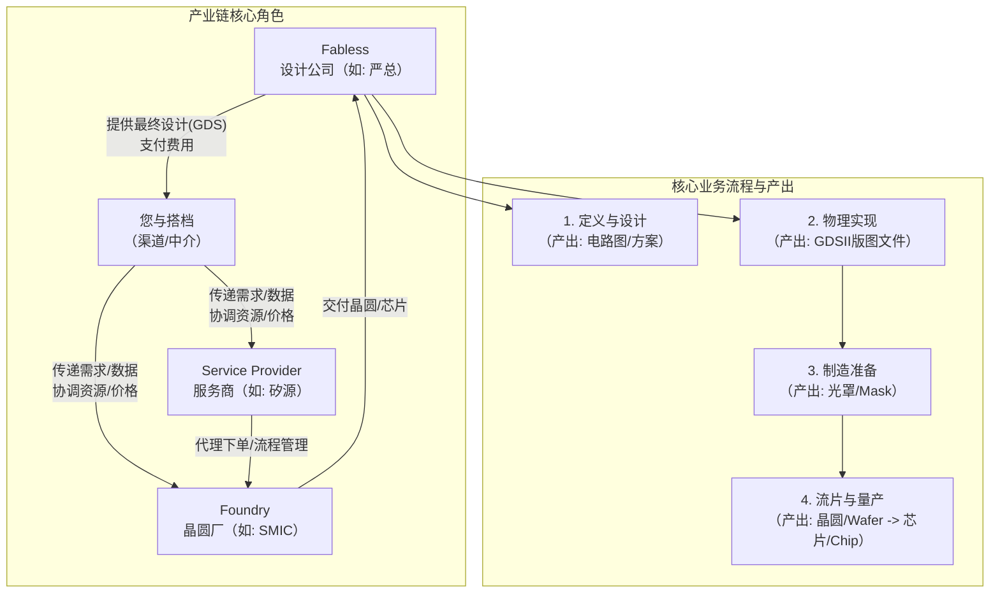

# 芯片产业链全景与角色定位

## 产业链协作全景

芯片从概念到产品的完整流程，以及核心生态位的关系如下：

---

## 第一部分：半导体产业链与核心角色（生态位）

要理解流程，先要明确"戏台"上有哪些"角色"。

### Fabless（无晶圆厂设计公司）

如客户"严总"。他们只负责芯片的设计和销售，将生产外包。他们是技术的源头和需求的发起方。

### Foundry（晶圆代工厂）

如中芯国际（SMIC）、台积电（TSMC）。他们拥有昂贵的晶圆厂（Fab），负责按照设计公司的图纸（GDS）制造芯片。他们是产能和工艺的提供方，拥有绝对话语权。

### IDM（整合器件制造商）

如英特尔、三星。自己完成设计、制造、封测全流程，通常不对外开放代工。

### 您与搭档（渠道/中介）

您的核心生态位。您不是设计者，也不是生产者，而是**价值的连接器与放大镜**。

您利用搭档在中兴/大客户处的资源，获取了更好的价格、产能优先级和流程支持，为 Fabless 公司（特别是中小客户）提供了他们难以直接获得的资源。您的价值在于**"资源杠杆"**和**"流程润滑"**。

### Service Provider（服务商/代理）

如"矽源"。他们提供 PDK 支持、MPW 拼单、流程管理、商务对接等专业服务，是产业链的"润滑剂"。

---

## 第二部分：一颗芯片的诞生——从想法到产品的完整流程

### 1. 定义与设计

- **做什么：** 定义芯片的功能、性能、功耗、成本目标
- **关键输出：** 电路设计图
- **你需要注意的：** 客户在此阶段需要向晶圆厂申请 PDK。你搭档的价值可以在此处体现（协助快速获取）

### 2. 前端设计与验证

- **做什么：** 用硬件描述语言编写代码，进行功能仿真
- **关键输出：** 可综合的 RTL 代码

### 3. 后端设计与物理实现

- **做什么：** 将 RTL 代码转换成实际的物理版图（GDSII 文件），这是最复杂的步骤之一
- **关键输出：** GDSII 文件（芯片的最终制造图纸）
- **核心环节：**
  - **DRC / LVS** — 物理验证，确保版图符合制造规则且与电路图一致。这里出现的任何问题（如 HVDMY、Waive）都可能导致返工和延期
  - **Tape-Out（流片）** — 指将最终 GDSII 数据提交给晶圆厂这一行为，是设计阶段的终点，制造阶段的起点

### 4. 制造准备

- **做什么：** 晶圆厂处理 GDS 数据，准备生产
- **核心环节：**
  - **JDV** — 晶圆厂的数据打包和最终确认环节。这是"后悔"的最后期限，之后修改代价巨大
  - **Mask Making（光罩制作）** — 根据 GDS 制作每一层电路的光学模板（光罩）。这是 NRE 成本的大头。如"36层 mask 21万美金"就是指这个

### 5. 晶圆制造

- **做什么：** 在晶圆厂（Fab）里，通过数百道复杂工艺（光刻、刻蚀、离子注入等），将电路图形一层层做在硅片上
- **关键输出：** Wafer（晶圆），上面有数百到数千颗裸片（Die）

### 6. 封装与测试

- **做什么：** 将晶圆切割成裸片，封装成独立的芯片，并进行功能和可靠性测试
- **关键输出：** Chip（芯片），可以焊接在电路板上的成品

---

## 第三部分：核心概念、成本与生意经

### 两种核心成本模式

| 模式 | 说明 | 你的价值 |
|---|---|---|
| **NRE**（一次性工程费用） | 主要为光罩费。一次性投入，沉没成本。公式 ≈ 单层光罩价 × 总层数 + 工程服务费 | 通过经验帮助客户优化设计、减少层数、争取免费修改，以控制 NRE |
| **Wafer Cost**（晶圆成本） | 量产后每片晶圆的制造费。决定芯片的边际成本 | 通过渠道拿到优于公开市场的价格（如 2200 美金 vs 市场价 2400+） |

### 两种核心生产模式

| 模式 | 说明 |
|---|---|
| **MPW**（多项目晶圆） | 多家"拼单"。大幅降低 NRE，用于小批量试产。需要理解"班次（Shuttle）"概念 |
| **Full Mask**（全掩模） | 独占整个光罩和晶圆。成本高，用于大规模量产。对应的量产订单称为 **NTO** |

### 关键风险与价值点

#### Retooling（重新制版）

流片前最后一刻修改设计导致光罩重做。是成本超支和项目延期的头号杀手。

你作为协调人，在 GDS 到 JDV 阶段帮助客户高效决策、锁定修改范围，就是在管理最大的风险。

#### Code（客户代码）

在晶圆厂的"开户"资格。目前大厂门槛极高（如 SMIC 要求月产千片以上）。

**你最大的价值之一**，就是让新客户能绕过此门槛，通过既有渠道（如 B 客户）下单。

#### 产能与交期

芯片制造产能是周期性波动的稀缺资源。你承诺的"不缺产能"和"更快周期"（如 1.2 天/片 vs 行业 2 天/片），是强大的竞争筹码。

---

## 第四部分：行业"常识"与潜在陷阱

### 1. 供应链波动

芯片行业有强烈的"牛鞭效应"，产能时紧时松。需要关注行业周期——在产能紧张时你的渠道价值更大。

### 2. IP（知识产权）

芯片设计严重依赖第三方 IP 核（如 ARM 的 CPU 核）。IP 授权费（一次性 + 版税）是另一大块成本，谈判复杂。

### 3. 良率

不是所有生产出来的芯片都是好的。良率直接影响有效成本和供货能力。新工艺、新设计初期良率通常较低。

### 4. "黑话"文化

行业充斥着缩写和行话（如 Tape-out, MPW, NRE, DRC Waive）。熟练掌握这些语言是获得信任的敲门砖。

### 5. 长周期与高信任

一个芯片项目从启动到量产常以"年"计，涉及巨额资金。因此，生意建立在长期关系和深度信任之上。作为中介，建立**"可靠、专业、能解决问题"**的口碑至关重要。

---

## 总结：你的定位与行动框架

你不是工程师，但你需要是：

- **流程的导航员** — 清晰知道项目在流程图的哪个位置，下一个关键节点是什么（是等 JDV 确认，还是催 GDS？）
- **风险的雷达** — 能识别当前阶段的最大风险（是在 DRC 验证，还是在怕错过 MPW 班次？），并提前协调资源
- **价值的翻译官** — 将技术术语（如"Retooling 5 层"）翻译成商业语言（"要加 5 万美金，延迟 2 周"），并把自己的渠道优势（价格、产能、免费修改机会）用客户关心的商业结果（降低成本、加快上市、控制预算）表达出来

你已经掌握了足够的知识碎片，现在它们被串联成一张地图。接下来就是在实战中，拿着这张地图，为客户指引一条更优的路径，这就是你生意的核心。
